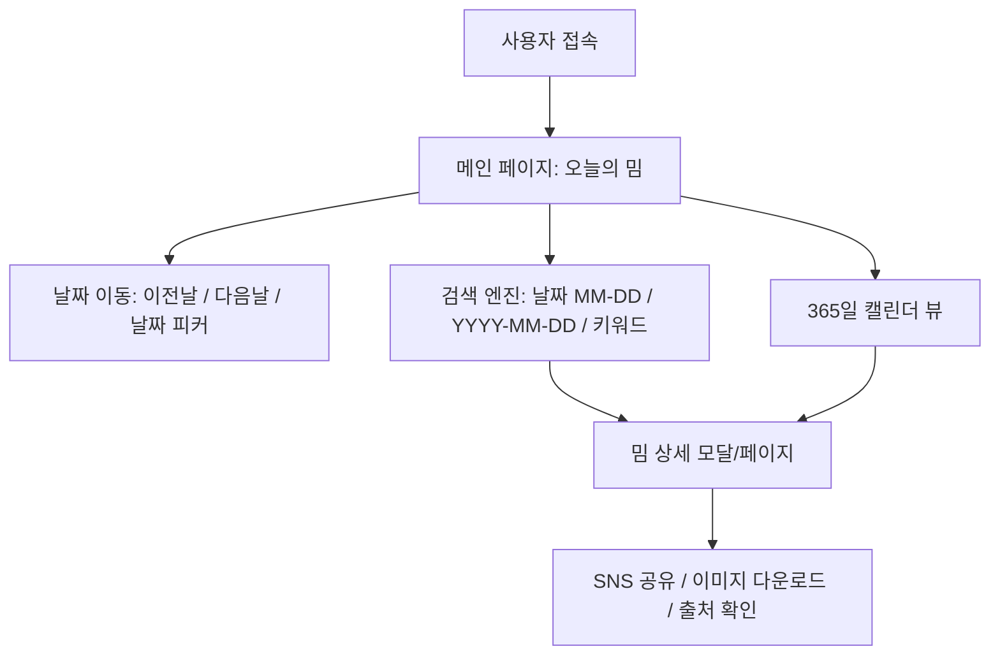

# [기획서] 날짜 기반 밈 수집 & 검색 서비스: "Meme of the Day" (가칭)

> **"오늘 무슨 밈의 날인지 알아?"**  
> 날짜와 연관된 전설적인 밈들을 아카이빙하고, 오늘 날짜의 밈을 즉시 확인하며 날짜/키워드로 탐색할 수 있는 웹 큐레이션 서비스

---

## 1. 프로젝트 개요 (Overview)

### 1.1. 기획 배경 및 목적
- **밈과 날짜의 강력한 결합**: 인터넷 문화에는 특정 날짜에 주기적으로 소환되는 대표 밈들이 존재합니다.  
  *(예: 9월 1일 "9월 1일 요크신시티에서", 4월 1일 만우절 밈, 5월 5일 어린이날 밈, 12월 25일 솔로부대 밈, 수능일 밈 등)*
- **아카이빙 부재**: 이러한 밈들은 매년 SNS(X/Twitter, 커뮤니티 등)에서 산발적으로 소비되지만, 날짜별로 정리된 체계적인 아카이브가 없습니다.
- **서비스 목표**:
  1. 접속 시 **'오늘 날짜'의 대표 밈을 바로 확인**하고 즐길 수 있는 직관적인 경험 제공
  2. **특정 날짜(MM-DD, YYYY-MM-DD) 및 키워드**로 손쉽게 밈을 검색하고 원작/맥락을 파악할 수 있는 아카이브 구축
  3. **Git 레포 내 `data/` 디렉토리 기반 자산 관리 + Cloudflare Pages 정적 호스팅**으로 인프라 관리 부담 제로의 순수 웹 서비스 구현

---

## 2. 핵심 타겟 및 사용 시나리오 (User Scenario)

| 타겟 사용자 | 니즈 | 사용 시나리오 |
| :--- | :--- | :--- |
| **일반 네티즌 / 커뮤니티 유저** | "오늘 무슨 밈 쓰는 날이지?" | 메인 페이지에 접속하여 오늘 날짜의 밈을 확인하고 단톡방이나 SNS에 바로 공유 |
| **콘텐츠 크리에이터 / 마케터** | 날짜별 시즌 밈 아이디어 탐색 | 캘린더 뷰나 날짜 검색으로 특정 시기(예: 10월 말, 특정 기념일)의 밈 레퍼런스 발굴 |
| **서브컬처 / 오픈소스 기여자** | 밈 등록 및 원본 클립 기여 | `data/media` 폴더에 이미지만 추가해서 PR을 올리면 즉시 배포 (JSON 작성은 선택 사항) |

---

## 3. 기능 명세서 (Functional Requirements)



### 3.1. [F-01] 메인 화면 (Today's Meme)
- **오늘의 대표 밈 자동 노출**:
  - 접속자의 로컬 타임존(기본: KST 한국 표준시) 기준 오늘 날짜(MM월 DD일) 매칭.
  - 해당 날짜에 등록된 대표 밈의 사진/동영상을 히어로(Hero) 섹션에 풀사이즈로 표시.
- **오늘의 다른 밈 캐러셀(Carousel)**:
  - 같은 날짜에 여러 개의 밈이 존재할 경우 스와이프/캐러셀 형태로 탐색 지원.
- **날짜 퀵 네비게이션**:
  - [어제 밈], [내일 밈] 버튼 및 캘린더 피커(DatePicker)를 통해 원하는 날짜로 1클릭 이동.
- **공유 및 다운로드**:
  - SNS 공유 버튼 (X, 카카오톡, 링크 복사) 및 다이렉트 이미지/동영상 저장.

### 3.2. [F-02] 밈 검색 (Search)
- **날짜 검색 패턴 지원**:
  - `9월 1일`, `09-01`, `0901`, `9/1` 등 다양한 날짜 입력 포맷 지원.
  - 특정 연도 사건 밈: `2000-09-01`, `2023-04-01` 등 YYYY-MM-DD 검색 지원.
- **키워드 및 태그 검색**:
  - 제목, 설명, 등장인물, 원작(애니/영화/드라마/스트리머), 태그 기반 실시간 검색.
  - 별도 JSON이 없는 밈도 파일명(slug) 기반으로 검색 매칭.

### 3.3. [F-03] 365 캘린더 뷰 (Calendar Archive)
- **월간/연간 캘린더 인터페이스**:
  - 1월 1일부터 12월 31일까지 달력 형태로 날짜별 대표 썸네일 그리드 노출.
  - 밈이 없는 날짜는 "GitHub에서 밈 추가하기" 플레이스홀더 제공.

### 3.4. [F-04] 밈 상세 정보 (Meme Detail)
- **미디어 뷰어**: 고해상도 이미지(WebP/PNG/JPG), GIF, 비디오(MP4/WebM).
- **밈 맥락(Lore & Context)**: 유래, 첫 등장 시점(연도), 원작 출처 링크 (JSON에 등록된 경우 표시).

---

## 4. 데이터 저장 구조 및 하이브리드 파이프라인 (Option B)

**파일명 기반 자동 추출 + 선택적 `memes.json` 메타데이터 결합 방식**을 채택하여 편의성과 확장성을 모두 확보합니다.

```mermaid
graph LR
    Files["📁 data/media/<br>2000-09-01_yorknew-city.jpg<br>0000-04-01_april-fools.webp"] --> Parser[파일명 파서<br>날짜/슬러그 자동 추출]
    JSON["📄 data/memes.json<br>(선택적 메타데이터)"] --> Merger[데이터 병합 엔진<br>(Data Merger)]
    Parser --> Merger
    Merger --> FinalDataset["통합 밈 데이터셋 (Unified Dataset)"]
    FinalDataset --> WebUI[Cloudflare Pages 웹 UI]
```

### 4.1. 디렉토리 구조
```text
meme-of-the-day/
├── data/
│   ├── media/                          # 미디어 파일 (이미지, gif, 동영상)
│   │   ├── 2000-09-01_yorknew-city.jpg
│   │   ├── 0000-04-01_april-fools.webp
│   │   └── 2022-12-03_important-unbreakable-mind.png
│   └── memes.json                      # [선택] 상세 메타데이터 (설명, 태그, 출처 등)
├── docs/
│   └── PRD.md
└── src/                                # 웹 프론트엔드 소스코드
```

### 4.2. 파일 네이밍 규칙 (`YYYY-MM-DD_name`)
- **특정 연도 발생 밈**: `{YYYY}-{MM}-{DD}_{slug}.{ext}`  
  *(예: `2000-09-01_yorknew-city.jpg`, `2022-12-03_unbreakable-mind.png`)*
- **매년 반복되는 밈**: `0000-{MM}-{DD}_{slug}.{ext}`  
  *(예: `0000-04-01_april-fools.webp`, `0000-12-25_solo-army.jpg`)*

### 4.3. 데이터 병합(Merge) 로직

1. **파일만 존재하는 경우 (기본 동작)**:
   - 파일명: `2000-09-01_yorknew-city.jpg`
   - 자동 생성 메타데이터:
     - 날짜: 9월 1일 (2000년)
     - 기본 제목: "Yorknew City" (슬러그를 사람이 읽기 쉬운 텍스트로 변환)
     - 미디어 경로: `/data/media/2000-09-01_yorknew-city.jpg`
     - 태그: `["09-01", "yorknew", "city"]`
   - 👉 **파일만 넣어도 웹사이트에 즉시 정상 노출 및 날짜 매칭 완료!**

2. **`memes.json`에 추가 정보가 있는 경우 (오버라이드/보강)**:
   - 해당 파일명 또는 slug를 키로 매핑하여 한글 제목, 상세 설명, 태그, 원작 출처 등을 풍부하게 보강.

```json
[
  {
    "id": "2000-09-01_yorknew-city",
    "title": "9월 1일 요크신시티에서",
    "tagline": "9월 1일 요크신시티에서 만나자.",
    "description": "만화 '헌터x헌터'에서 주인공 일행과 환영여단이 집결하기로 약속한 운명의 날짜. 매년 9월 1일이 되면 덕후 커뮤니티에 소환되는 대표적인 날짜 밈.",
    "source": {
      "origin": "헌터x헌터 (Hunter x Hunter)",
      "url": "https://namu.wiki/w/요크신시티"
    },
    "tags": ["헌터헌터", "크라피카", "환영여단", "9월1일", "요크신시티", "애니"]
  }
]
```

---

## 5. 시스템 아키텍처 & 기술 스택 (Cloudflare Pages)

```mermaid
graph LR
    Dev[개발자 / 기여자] -->|Git Commit & Push<br>data/media + (memes.json)| GitHub[GitHub Repo]
    GitHub -->|자동 빌드 Webhook| CF_Pages[Cloudflare Pages]
    CF_Pages -->|정적 자산 배포 & 캐싱| EdgeCDN[Cloudflare Global CDN]
    EdgeCDN -->|초고속 서빙| User[사용자 웹 브라우저]
```

### 5.1. 추천 기술 스택
| 영역 | 기술 스택 | 설명 및 이점 |
| :--- | :--- | :--- |
| **호스팅 & CDN** | **Cloudflare Pages** | Git Push 시 자동 정적 빌드 및 배포, 글로벌 초고속 엣지 캐싱, 무제한 대역폭 |
| **프론트엔드 프레임워크** | **Astro** (또는 React/Vite) | 정적 사이트 생성(SSG) 최적화, 빌드 시 `data/media` 자동 스캔 및 색인 |
| **데이터 & 미디어 관리** | **Git Repo (`data/`)** | 하이브리드 파이프라인 (파일명 자동 추출 + 선택적 JSON) |
| **스타일링** | **Tailwind CSS** | 반응형 모바일 최적화 및 다크 모드 지원 |

---

## 6. 개발 단계별 구현 계획

1. **Step 1: 빌드 타임 데이터 파서 구현**
   - `data/media/` 디렉토리 내의 파일 목록을 읽고 `YYYY-MM-DD_name` 파싱
   - `data/memes.json`이 존재할 경우 병합(Merge)하여 단일 데이터셋 생성
2. **Step 2: 프론트엔드 UI 구축 (Astro / React + Tailwind)**
   - 오늘 날짜 밈 자동 노출 메인 화면
   - 날짜 및 키워드 실시간 검색 기능
   - 365일 캘린더 아카이브 뷰
3. **Step 3: 샘플 밈 데이터 추가 및 로컬 테스트**
   - 9월 1일 요크신시티 밈 등 대표 밈 샘플 파일 및 JSON 추가
4. **Step 4: Cloudflare Pages 배포 설정**
   - Wrangler / GitHub 연동 및 배포 스크립트 구성
